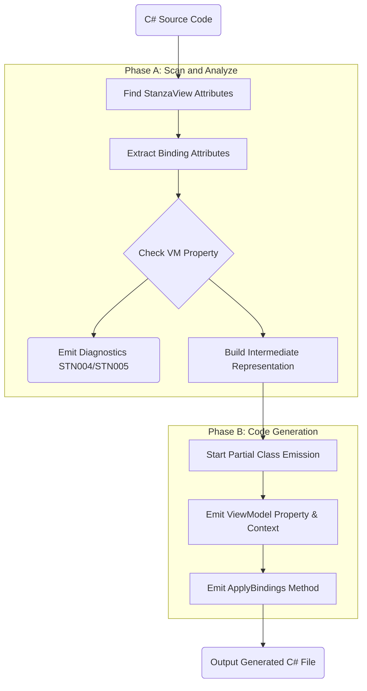
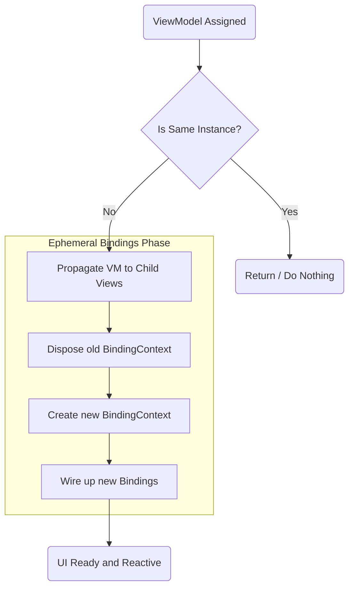

# Generator Architecture & Lifecycle

## 1. The Transformation Pipeline

The Source Generator acts as a lightweight compiler, translating Binding Attributes into native Terminal.Gui subscriptions through a strict pipeline:

- **Scan**: Uses Roslyn's `IIncrementalGenerator` to find properties and fields decorated with Stanza binding attributes.
- **Analyze**: Validates the bindings against the target ViewModel (e.g., checking for read-only properties) and builds a clean Intermediate Representation (IR).
- **Emit**: Generates the MVVM boilerplate and the `ApplyBindings()` method in a partial class.

## 2. The Idempotent Lifecycle

Generated code strictly separates UI creation from data binding to preserve UI state (focus, cursor position) when ViewModels change.

- **Developer Creation**: The developer is responsible for instantiating the views and adding them to the hierarchy in their constructor. The generator does not mutate the UI tree.
- **`ApplyBindings()`**: Runs every time the `ViewModel` property is set. It automatically disposes the old `BindingContext` and wires up the new data subscriptions generated from the attributes.

## 3. View-Model Propagation

Nested subviews shouldn't require manual data-context wiring.

- **Automatic Forwarding**: If a child view exposes a compatible `ViewModel` property, the generator automatically injects the parent's ViewModel instance into the child during initialization.

