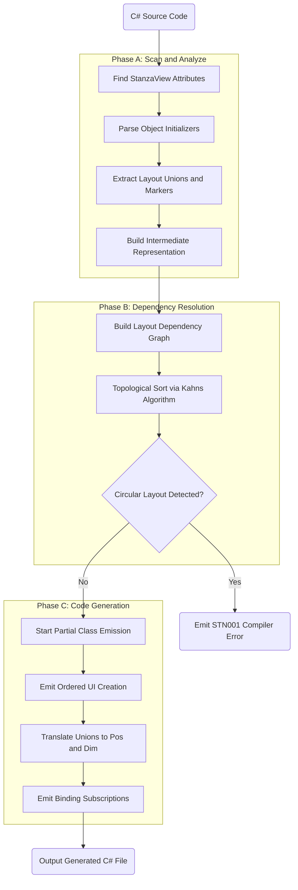
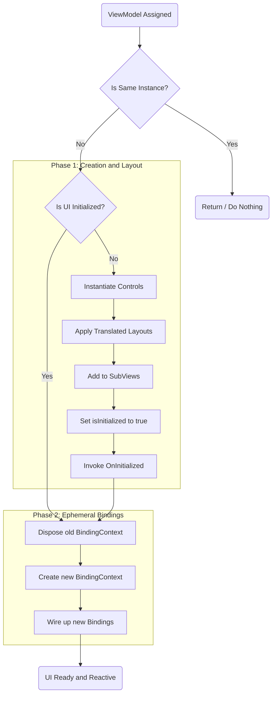

# Generator Architecture & Lifecycle

## 1. The Transformation Pipeline

The Source Generator acts as a compiler, translating the DSL into native Terminal.Gui code through a strict pipeline:

- **Scan**: Extracts object initializers from the Roslyn AST.
- **Analyze**: Converts C# syntax into a clean Intermediate Representation (IR).
- **Resolve**: Computes dependencies and orders the components.
- **Emit**: Generates the final partial class.

## 2. Topological Sorting (Dependency Resolution)

Controls must be instantiated before they can be referenced in layout constraints (e.g., placing `Input` below `Header` requires `Header` to exist).

- **Kahn's Algorithm**: Orders the instantiation of views based on their `Anchor` targets.
- **Static Analysis**: Detects circular layout dependencies at compile-time and aborts the build with a compiler error (`STN001`).

## 3. The Idempotent Lifecycle

Generated code strictly separates UI creation from data binding to preserve UI state (focus, cursor position) when ViewModels change.

- **`InitializeComponent()`**: Runs exactly once. Instantiates views, applies layout translations (`Pos`/`Dim`), and builds the subview hierarchy.
- **`ApplyBindings()`**: Runs every time the `ViewModel` property is set. Disposes the old `BindingContext` and wires up the new data subscriptions.

## 4. View-Model Propagation

Nested subviews shouldn't require manual data-context wiring.

- **Automatic Forwarding**: If a child view exposes a compatible `ViewModel` property, the generator automatically injects the parent's ViewModel instance into the child during initialization.

## 5. Extensibility and Overrides

The generated layout serves as a baseline initialization, not a strict runtime constraint. Because Stanza compiles down to standard Terminal.Gui `Pos` and `Dim` objects, developers retain full control to override, mutate, or animate the layout.

- **The `OnInitialized` Hook**: The generator emits and calls a `partial void OnInitialized();` method at the very end of UI creation. Implementing this partial method gives the developer a guaranteed safe execution window to override DSL-generated layouts before the view renders.
- **Constructor Control**: Developers who implement custom constructors dictate exactly when the `ViewModel` is assigned (which triggers `InitializeComponent`). This allows them to execute manual layout logic immediately after the DSL finishes its setup.
- **Dynamic Mutability**: Because the DSL markers act only as initializers, the resulting `X`, `Y`, `Width`, and `Height` properties can still be dynamically reassigned at runtime in response to events or commands.

